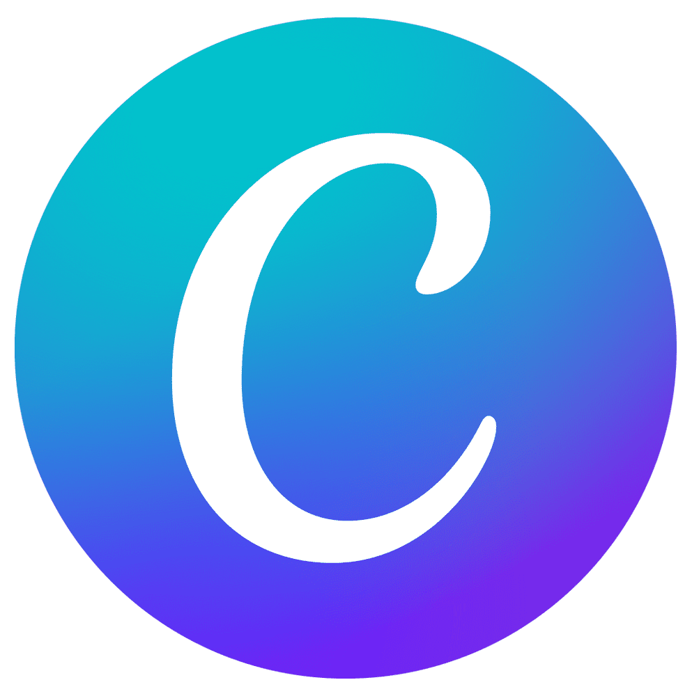
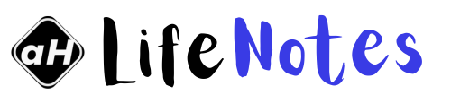
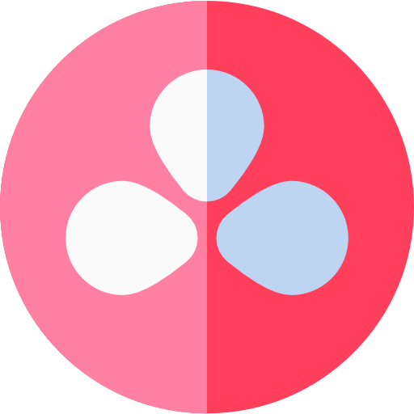
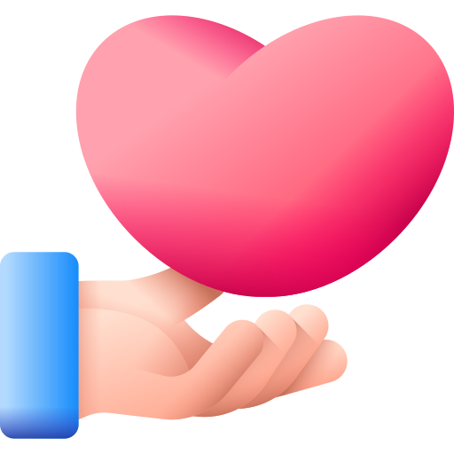
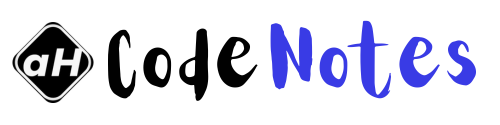

<html>
  <head>
  </head>
    <body>

  <picture>
    <source srcset="assets/ReadmeBanner-dark.gif" media="(prefers-color-scheme: dark)">
    <source srcset="assets/ReadmeBanner-bright.gif" media="(prefers-color-scheme: light)">
    
  </picture>

<!--

<!-- <h1 align="center">Hi, I'm <a href="https://ayushhardeniya.site/">Ayush Hardeniya</a> 👋</h1> -->
<h2 align="center">[a.k.a Ayush Sharma]</h2> 

  🌱 Learner | 💻 Creator | 🎥 Editor |   ᝰ.ᐟ Writer

<!--
 -->

<!---->
 🔗 **Visit My Website**: [ayushHardeniya.site](https://ayushhardeniya.site)

---

### 👨‍💻 About Me

I'm _**Ayush Hardeniya**_ - someone who enjoys solving problems through code, **designing systems**, and giving a **creative** touch to whatever I build. 

I'm **learning web development, hosting,** and **video editing,** while also staying grounded through music, meditation, and early mornings 🌄.

---

### 🚀 What I’m On (Working/Exploring)

 
<table align="left">
  <tr>
    <td align="center">
      
    </td>
    <td align="center">
      
    </td>
    <td align="center">
      
    </td>
    <td align="center">
      
    </td>
    <td align="center">
      
    </td>
    <!--
    <td align="center">
      
    </td> -->
  </tr>
  <tr>
    <td align="center">
      
    </td>
    <td align="center">
      
    </td>
    <td align="center">
      
    </td>
      <td align="center">
      
    </td>
    <td align="center">
      
    </td>
    <!--
    <td align="center">
      
    </td> -->
  </tr>
</table>

             

---

### 🛠️ Tech Stack

| Language / Tools    | Skills |
|---------------------|--------|
| `C & C++`           | 🧠 Logic building |
| `HTML + CSS`        | 🌐 Static pages, layouts |
| `VS Code`           | 📝 Main code editor |
| `Git & GitHub`      | 🔧 Version control, 🤝collaboration |
| `Canva`             | 🎨 Design & Editing |
| `DaVinci Resolve 19`| 🎞️ Video Editing |

---

### 🤝 "Open Source" Welcome

Hey there, **curious mind**! 👀  
Spotted something on my website that needs fixing? 
**Perfect chance to practice your **open source** skills!**  

[Click here to visit the website repo & start contributing! 🚀](https://github.com/ayushHardeniya/ayushhardeniya.github.io/tree/main)
  
New contributors welcome • **Good first issues available**

---

### 📈 GitHub Stats

<table>
  <tr>  
    <td align="center">
      
    </td>
  <!--  <td>
      
    </td> -->
    <td>
      
    </td>
    <!--<td>
      
    </td> -->
  </tr>
  </table>

---

### 🌐 Where I Share & Create 

[**Find Me Online!**]
 

  <table>
    <tr>
      <td align="center">
        
      </td>
      <td align="center">
        
      </td>
      <td align="center">
        
      </td>
      <td align="center">
        
      </td>
    </tr>
  </table>
  
  <table>
    <tr>
      <td align="center">
        
      </td>
      <td align="center">
        
      </td>
    </tr>
  </table>

 <!--  -->

---

### 🤍 Personal Mantras

> *Consistency beats talent when talent doesn’t show up.*  
> *Wake up early, stay humble, work on your craft silently.*

---

### 💰Fuel My Work
  
  
  
  

### Or Just

---

Thanks for stopping by! 👋  
Feel free to check out my pinned projects/repo and connect if you think we can collaborate.
  

</body>
</html>
